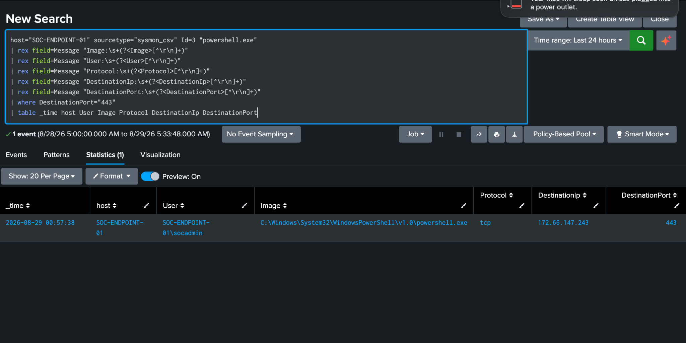
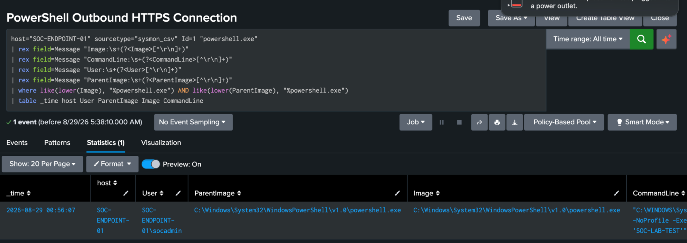

# Windows Sysmon Splunk SOC Lab

A hands-on Security Operations Center (SOC) lab using Windows 11, Sysmon, PowerShell, and Splunk Cloud to collect endpoint telemetry, create custom SPL detections, investigate simulated suspicious activity, and build a monitoring dashboard.

## Project Overview

The goal of this project was to simulate a basic SOC analyst workflow from endpoint telemetry collection through detection and investigation.

The lab involved:

- Configuring a Windows 11 endpoint
- Installing and configuring Sysmon
- Generating controlled PowerShell activity
- Collecting process and network telemetry
- Exporting Sysmon logs for analysis
- Ingesting telemetry into Splunk Cloud
- Creating custom SPL detections
- Investigating suspicious activity
- Building a SOC monitoring dashboard

## Lab Architecture

Windows 11 Endpoint  
↓  
Sysmon  
↓  
Windows Event Logs  
↓  
CSV Export  
↓  
Splunk Cloud  
↓  
SPL Detection & Investigation  
↓  
SOC Dashboard

## Lab Environment

- Windows 11 Pro
- Sysmon
- PowerShell
- Splunk Cloud
- VMware Fusion
- GitHub
- Hostname: `SOC-ENDPOINT-01`

## Telemetry Collection

Sysmon was configured to capture endpoint activity including:

- Event ID 1 — Process Creation
- Event ID 3 — Network Connections
- Event ID 11 — File Creation

Sysmon telemetry was exported from the Windows endpoint and uploaded into Splunk Cloud for analysis.

## Detection Engineering

Four custom detections were created using Splunk SPL.

### 1. Execution Policy Bypass Activity

Detects PowerShell processes launched using:

`-ExecutionPolicy Bypass`

This behavior may be used by attackers to execute PowerShell scripts while bypassing local execution-policy restrictions.

```spl
host="SOC-ENDPOINT-01" sourcetype="sysmon_csv" Id=1
| rex field=Message "Image:\s+(?<Image>[^\r\n]+)"
| rex field=Message "CommandLine:\s+(?<CommandLine>[^\r\n]+)"
| rex field=Message "User:\s+(?<User>[^\r\n]+)"
| rex field=Message "ParentImage:\s+(?<ParentImage>[^\r\n]+)"
| where match(lower(Image), "powershell\.exe$") AND match(lower(CommandLine), "executionpolicy\s+bypass")
| table _time host User Image CommandLine ParentImage
```

### 2. PowerShell Outbound HTTPS Connection

Detects PowerShell processes establishing outbound TCP connections over port 443.

Network-enabled PowerShell activity can be legitimate but may also be associated with payload retrieval or command-and-control activity.

```spl
host="SOC-ENDPOINT-01" sourcetype="sysmon_csv" Id=3 "powershell.exe"
| rex field=Message "Image:\s+(?<Image>[^\r\n]+)"
| rex field=Message "User:\s+(?<User>[^\r\n]+)"
| rex field=Message "Protocol:\s+(?<Protocol>[^\r\n]+)"
| rex field=Message "DestinationIp:\s+(?<DestinationIp>[^\r\n]+)"
| rex field=Message "DestinationPort:\s+(?<DestinationPort>[^\r\n]+)"
| where DestinationPort="443"
| table _time host User Image Protocol DestinationIp DestinationPort
```

### 3. Nested PowerShell Execution

Detects PowerShell processes spawning additional PowerShell processes.

Nested scripting activity may indicate chained command execution and should be investigated alongside command-line and parent-process telemetry.

```spl
host="SOC-ENDPOINT-01" sourcetype="sysmon_csv" Id=1 "powershell.exe"
| rex field=Message "Image:\s+(?<Image>[^\r\n]+)"
| rex field=Message "CommandLine:\s+(?<CommandLine>[^\r\n]+)"
| rex field=Message "User:\s+(?<User>[^\r\n]+)"
| rex field=Message "ParentImage:\s+(?<ParentImage>[^\r\n]+)"
| where like(lower(Image), "%powershell.exe") AND like(lower(ParentImage), "%powershell.exe")
| table _time host User ParentImage Image CommandLine
```

### 4. Elevated PowerShell Execution

Detects PowerShell processes executing with a High integrity level.

The detection was refined to identify the actual PowerShell executable instead of matching references to PowerShell contained within unrelated parent-process telemetry.

```spl
host="SOC-ENDPOINT-01" sourcetype="sysmon_csv" Id=1
| rex field=Message "Image:\s+(?<Image>[^\r\n]+)"
| rex field=Message "CommandLine:\s+(?<CommandLine>[^\r\n]+)"
| rex field=Message "User:\s+(?<User>[^\r\n]+)"
| rex field=Message "IntegrityLevel:\s+(?<IntegrityLevel>[^\r\n]+)"
| rex field=Message "ParentImage:\s+(?<ParentImage>[^\r\n]+)"
| where match(lower(Image), "powershell\.exe$") AND IntegrityLevel="High"
| table _time host User IntegrityLevel Image ParentImage CommandLine
```

## Incident Investigations

### Incident 1 — Execution Policy Bypass

Sysmon Event ID 1 identified `powershell.exe` executing with the `-ExecutionPolicy Bypass` argument.

The event was reviewed using:

- Process image
- Command line
- User
- Parent process
- Endpoint hostname

The activity was intentionally generated as part of the lab.

**Classification:** True Positive / Authorized Simulation

**MITRE ATT&CK:** T1059.001 — PowerShell

---

### Incident 2 — PowerShell Outbound HTTPS

Sysmon Event ID 3 identified `powershell.exe` establishing an outbound TCP connection to port 443.

The investigation correlated:

- Process
- User
- Destination IP
- Destination port
- Network protocol

The connection originated from controlled PowerShell activity generated during the lab.

**Classification:** True Positive / Authorized Simulation

**MITRE ATT&CK relevance:**

- T1059.001 — PowerShell
- T1071.001 — Web Protocols

---

### Incident 3 — Nested Elevated PowerShell

Sysmon Event ID 1 identified a PowerShell process spawning another PowerShell process running with a High integrity level.

The investigation reviewed:

- Parent process
- Child process
- User
- Integrity level
- Command-line arguments

Nested PowerShell execution combined with elevated privileges can represent suspicious behavior in a production environment.

The activity was intentionally generated for the lab.

**Classification:** True Positive / Authorized Simulation

**MITRE ATT&CK:** T1059.001 — PowerShell

## SOC Dashboard

A Splunk Classic Dashboard was created to provide visibility into the detections developed during the project.

Dashboard panels include:

- Elevated PowerShell Activity
- PowerShell Outbound HTTPS
- Nested PowerShell Execution
- ExecutionPolicy Bypass Activity

## Skills Demonstrated

- Security monitoring
- SIEM analysis
- Splunk
- SPL
- Sysmon
- Windows Event Logging
- PowerShell
- Detection engineering
- Log analysis
- Incident investigation
- Endpoint telemetry analysis
- MITRE ATT&CK mapping
- SOC workflow development

## Project Limitations

This project was completed in a controlled lab environment.

All suspicious activity was intentionally generated for educational and defensive cybersecurity purposes. No malicious payloads or unauthorized systems were used.

## Screenshots

### SOC Endpoint Monitoring Dashboard


### Elevated PowerShell Execution


### PowerShell Outbound HTTPS Connection



### Nested PowerShell Execution



### Execution Policy Bypass


### Sysmon Configuration


